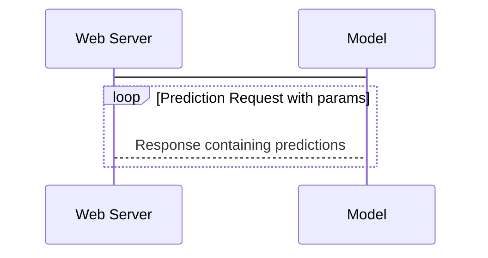

# Sentiment Sage

## High-Level Description:
Sentiment Sage is a REST API built using Docker, incorporating a machine learning model reliant on NLTK (Natural Language Toolkit). This API serves as a standalone sentiment prediction system. It analyzes input sentences and produces sentiment scores, considering positivity, negativity, and neutrality. The underlying sentiment classification strategy is rule-based, employing VADER (Valence Aware Dictionary and Sentiment Reasoner), which is adept at interpreting sentiments found in social media.

## Features:

- **Architecture**: The system is containerized using Docker for easy deployment and management.
- **Machine Learning Model**: Built on NLTK, the model processes text input to predict sentiment.
- **Functionality**: The API receives sentences as input and returns sentiment scores.
- **Sentiment Scoring**: Each sentence is analyzed for positivity, negativity, and neutrality.
- **Sentiment Classification**: VADER is utilized for sentiment classification.
- **VADER**: VADER is a lexicon and rule-based sentiment analysis tool, specialized for social media sentiments.
- **Rule-Based Strategy**: Sentiment classification is driven by predetermined rules within VADER.
- **Output**: The API provides a comprehensive sentiment analysis report for each input sentence.

# Build Docker

docker build -t sample_model .

# Run Docker

docker run -p 8000:8000 sample_model

# API Interface

1. http://0.0.0.0:8000
2. http://0.0.0.0:8000/docs
3. http://0.0.0.0:8000/health
4. http://0.0.0.0:8000/predict?q=this%20is%20great

# References
- https://www.nltk.org
- https://www.nltk.org/nltk_data/
- https://github.com/cjhutto/vaderSentiment
